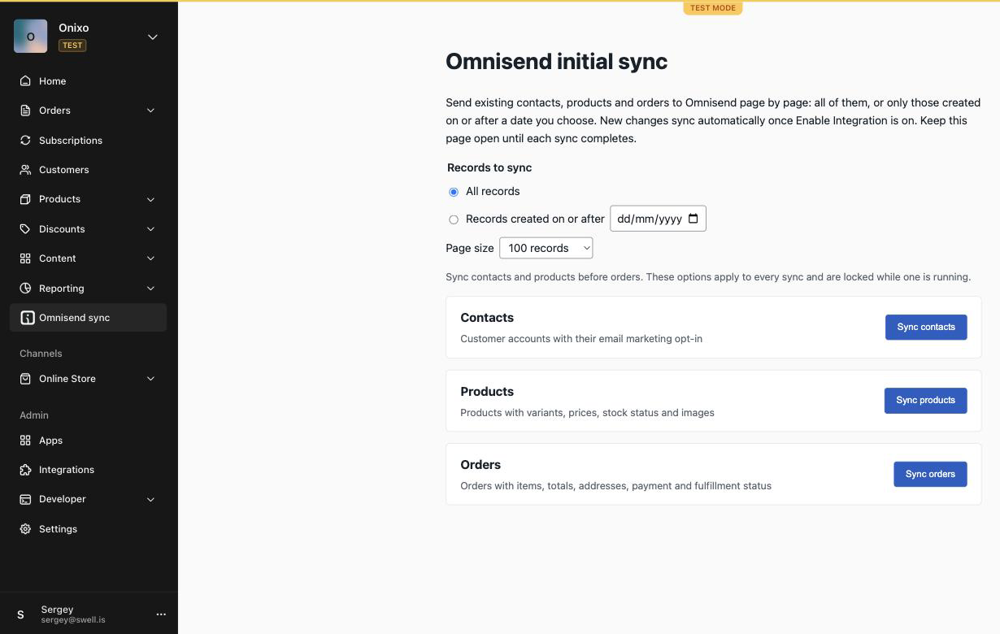
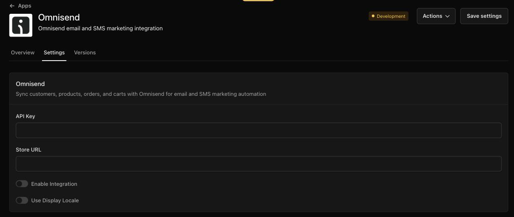

# Omnisend integration

A Swell app that syncs customers, products, carts and orders to [Omnisend](https://www.omnisend.com/) for email and SMS marketing automation.
It replicates the native Swell Omnisend integration, so you can use it as is or adapt it to your needs.

## Features

All data is sent to the [Omnisend API v3](https://api-docs.omnisend.com/) (`https://api.omnisend.com/v3`). Amounts are sent in cents.

### Real-time sync

| Swell event                        | Omnisend action                                     | Function                      |
| ---------------------------------- | --------------------------------------------------- | ----------------------------- |
| `account.created`                  | Create contact                                      | `functions/account-events.ts` |
| `account.updated`                  | Update contact                                      | `functions/account-events.ts` |
| `cart.created`                     | Create cart                                         | `functions/cart-events.ts`    |
| `cart.updated`                     | Update cart (or create it if missing in Omnisend)   | `functions/cart-events.ts`    |
| `cart.deleted`                     | Delete cart                                         | `functions/cart-events.ts`    |
| `order.submitted`                  | Create order                                        | `functions/order-events.ts`   |
| `order.updated`                    | Replace order                                       | `functions/order-events.ts`   |
| `product.created`                  | Create product                                      | `functions/product-events.ts` |
| `product.updated`                  | Replace product                                     | `functions/product-events.ts` |
| `product.variant.updated`          | Replace the parent product                          | `functions/product-events.ts` |
| `product.deleted`                  | Delete product                                      | `functions/product-events.ts` |

Events are processed only when **Enable Integration** is on and an API key is set.

**Contacts** – name, shipping address, city, state, country and postal code, plus custom properties
`company`, `shipping_phone`, `account_phone` and `email`. The email channel status follows the account's marketing
opt-in: `subscribed` when `email_optin` is true, otherwise `nonSubscribed` (dated with the account creation date). After a contact is created, the app stores its email on the account
in `omnisend_email` and uses it to find the contact on later updates.

**Carts** – cart total, currency, checkout ID, recovery URL (`checkout_url`), language and items
(title, product/variant ID, quantity, price, product URL, image). Only carts linked to a customer account are sent,
because Omnisend requires an email.

**Orders** – order number (digits only), totals (order, subtotal, discount, tax, shipping), currency, language,
shipping method and carrier, shipping and billing addresses, items, and statuses:

| Payment status      | When                                                                 |
| ------------------- | -------------------------------------------------------------------- |
| `partiallyPaid`     | Partly paid with a balance due                                       |
| `partiallyRefunded` | Refund total is above 0 and below the payment total                  |
| `refunded`          | Refund total equals the payment total                                |
| `paid`              | Paid with no balance                                                 |
| `awaitingPayment`   | Unpaid order with a total above 0                                    |

Fulfillment status is `fulfilled` when the order is delivered with no returned items, `unfulfilled` while items are
deliverable. For canceled orders `canceledDate` is the Swell cancel date, the date already stored in Omnisend, or the
current time.

**Products** – name, description, tags, stock status (`inStock`, `outOfStock`, `notAvailable`), first image
(or an Omnisend placeholder), product URL and variants. Variant prices include sale prices and option prices.
Products without variants are sent with a single variant.

Product and item URLs are built as `<Store URL>/<sku or slug>`.

### Initial sync page

The **Omnisend sync** item in the dashboard sidebar opens the app frontend (`frontend/`), where the merchant sends
existing data to Omnisend. Run it once after installing, otherwise Omnisend rejects events for records it does not
know yet.

- **Shared options** for every sync: all records, or only records created on or after a date; and the page size
  (10, 100, 200, 500 or 1000 records).
- **One row per entity** – Contacts, Products and Orders – each with its own **Sync**, **Stop** and
  **Resume from page N** buttons, a progress bar, the number of records sent, and error details if a page fails.
  Sync contacts and products before orders.
- The page calls the app Worker one page at a time (`POST /app-api/admin/sync`). Each call reads one page from Swell
  (sorted by creation date so pages stay stable) and sends it to Omnisend as one batch, so no request runs long.
  Contacts pages also store `omnisend_email` on the accounts in a single Swell batch request.
- The Worker only accepts same-origin JSON requests from a validated staff session of the store.



### Sync route

`POST /functions/omnisend/sync` (`functions/sync.ts`):

- With `entity` (`contacts`, `products` or `orders`) it syncs one page, like the sync page:
  `{ "entity": "contacts", "page": 1, "limit": 100, "created_after": "2026-09-01" }` returns
  `{ entity, page, limit, count, synced, done }`.
- Without `entity` it runs the full sync in one request: all contacts, then products, then orders, waiting for each
  batch type to finish before starting the next.

### API key validation

`POST /functions/omnisend/validate-login` with `{ "api_key": "..." }` (`functions/validate-login.ts`) returns
`{ "success": true | false }`. It checks the key by creating a test contact `validate@test.com` in Omnisend.

### Display locale

When **Use Display Locale** is on, orders and carts with a `display_locale` different from the store default are
fetched in that locale before they are sent, so product names and other localized fields match the customer's language.

## Settings

Configured in the app settings (`settings/omnisend.json`), under **Apps → Omnisend → Settings**. Credentials are never stored in code.



| Setting              | Type   | Required | Default | Description                                                                 |
| -------------------- | ------ | -------- | ------- | --------------------------------------------------------------------------- |
| `api_key`            | text   | yes      |         | Omnisend API key (Omnisend → Store settings → API keys).      |
| `store_url`          | text   | yes      |         | Storefront URL starting with `https://`, used for product and item links.  |
| `enabled`            | toggle | no       | off     | Turns real-time sync on. The sync route also requires it.                   |
| `use_display_locale` | toggle | no       | off     | Fetch orders and carts in their display locale before sending.             |

## Setup

1. Install the Swell CLI and log in:

   ```bash
   npm install -g @swell/cli
   swell login
   ```

2. Install dependencies and push the app to your store's test environment:

   ```bash
   cd /path/to/omnisend-integration
   npm install
   swell app push
   ```

3. In the Swell dashboard open **Apps → Omnisend → Settings**, enter the API key and store URL, and turn on
   **Enable Integration**.
4. **Disable the native Omnisend integration** in Swell, otherwise every event is sent twice.
5. Sync existing data to Omnisend: open **Omnisend sync** in the dashboard sidebar and sync contacts, products, then
   orders. From the CLI, sync one page at a time:

   ```bash
   swell api post /functions/omnisend/sync --body '{"entity":"contacts","page":1}'          # test environment
   swell api post /functions/omnisend/sync --body '{"entity":"contacts","page":1}' --live   # live environment
   ```

6. To install in the live environment, create a version and install it:

   ```bash
   swell app version minor
   swell app install
   ```

## Limits and known behavior

- **Duplicate events** if the native Swell Omnisend integration is enabled at the same time.
- **Keep the sync page open** – the sync runs in the browser page by page; closing the page stops it. Use
  **Resume from page N** to continue where it stopped.
- **Omnisend processes batches asynchronously** – a page counts as sent once Omnisend accepts the batch; Omnisend may
  still reject individual records later. Check batch results in Omnisend.
- **Full sync without `entity` runs in one request** – it pages through all accounts (100 per page), products and
  orders (1000 per page) and polls Omnisend every 2 seconds until batches finish. It is subject to the function
  timeout, so it can stop before finishing on large stores. Use the sync page or the page-by-page route instead.
- **Email consent is set once** – the opt-in is sent when the contact is created (or synced). Later opt-in changes
  on the account are not sent to Omnisend, because contact updates do not include the email channel status.
- **Contact updates** need `omnisend_email` on the account. Accounts created before the app was installed are updated
  only after the initial sync.
- **Guest carts** are not sent.
- **No retries** – failed Omnisend calls are logged (`console.error`) and dropped.
- **validate-login** leaves a `validate@test.com` contact in the Omnisend account.

## Development

### Project layout

```
functions/
  account-events.ts   # account.created / account.updated → contacts
  cart-events.ts      # cart.created / updated / deleted → carts
  order-events.ts     # order.submitted / updated → orders
  product-events.ts   # product.created / updated / deleted, product.variant.updated → products
  sync.ts             # POST route: one page of an entity, or the full initial sync
  validate-login.ts   # POST route: API key check
  lib/                # Omnisend client, payload builders, localization, page sync, batch polling
frontend/             # initial sync page (React) and app Worker, hosted by Swell
models/syncs.json     # placeholder collection for the sidebar entry
content/syncs.json    # "Omnisend sync" sidebar entry opening the frontend
settings/omnisend.json
assets/icon.png       # app icon (Omnisend mark)
assets/image.png      # social card (1200×630)
assets/images/        # App Store listing images, listed in swell.json "images"
assets/screenshots/   # dashboard screenshots used in this README
test/unit/            # vitest unit tests (Omnisend API mocked)
test/integration/     # vitest tests against the store using CLI auth
```

### Commands

```bash
npm run typecheck   # TypeScript check for functions, tests and the frontend
npm test            # run all vitest tests
swell app dev       # run functions locally, triggered by the test environment
swell app push      # deploy to the test environment
swell logs -f --app omnisend      # follow function logs
swell inspect functions --app=.   # check deployed functions and failures
```

Tests run in the Cloudflare Workers runtime via `@cloudflare/vitest-pool-workers` and use your `swell login` session
(or `SWELL_STORE_ID` / `SWELL_SESSION_ID` in CI). Unit tests mock `fetch`, so no real Omnisend calls are made.

Logs are also available in the dashboard under **Developer → Console → Logs**.

## Contributing

Contributions are welcome! Visit the [Swell Discord](https://discord.gg/VakSbyjDGZ) or [GitHub discussions](https://github.com/orgs/swellstores/discussions/) to get help and share ideas.

## License

This project is licensed under the MIT License - see [LICENSE.md](LICENSE.md) file for details.
